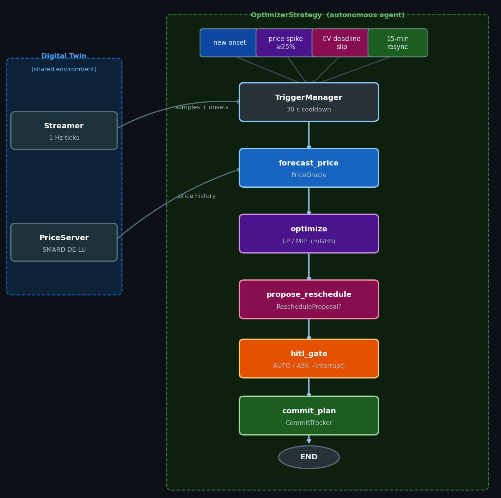
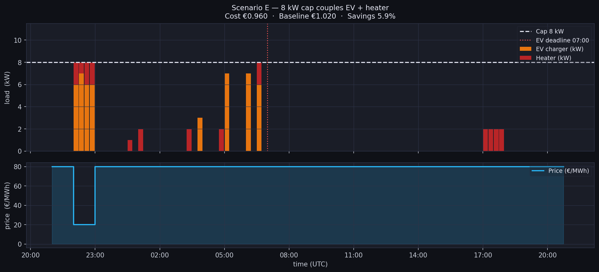

# AeroGrid — Streaming Home Energy Optimiser (Demo)

> **This is a research demo, not production software.**  
> It shows one end-to-end approach: real market prices → LP/MIP optimiser → LangGraph agent → human-in-the-loop HITL. Every component works, but most have known gaps listed at the bottom of this file.

AeroGrid is a 1 Hz streaming agent that shifts deferrable household loads — EV charger, hot-water heater, dishwasher, washing machine — into cheap price slots, and dispatches a Home Battery to buffer grid energy, using real SMARD DE-LU wholesale prices and a receding-horizon LP/MIP solver inside a LangGraph loop. An always-on Base Load (fridge, lights, standby, cooking) is included as exogenous demand that neither strategy can shift.

---

## Devices

| device | role | shifted by optimizer? |
|---|---|---|
| **EV Battery** (charger) | Deadline-driven load: must receive a fixed kWh by a daily deadline | Yes — LP picks the cheapest slots inside the EV window |
| **Hot-water Heater** | Deadline-driven load: must deliver kWh by per-window deadlines | Yes — LP spreads power across window slots |
| **Dishwasher** | User-triggered cycle: user starts it; HITL gate may shift it | Yes — MIP places it in the cheapest slot within the shift window |
| **Washing Machine** | User-triggered cycle: same as dishwasher | Yes — MIP places it in the cheapest slot within the shift window |
| **Home Battery** | Stationary storage: charges when cheap, discharges to offset load | Yes — LP decides `p_chg[t]` and `p_dis[t]` jointly with other loads |
| **Base Load** | Always-on inflexible demand (fridge, lights, standby, cooking) | No — exogenous; added to every slot's load but not a decision variable |

The **Home Battery** and the **EV Battery** are distinct devices with distinct roles. "Battery" alone is ambiguous — the codebase always qualifies it.

---

## Architecture



The **digital twin** owns only the simulation environment — the price feed, the clock, and the onset stream. It passes the same inputs to **N independent strategies** running in parallel, and collects their outputs. All scheduling logic lives inside the strategies themselves, which makes it straightforward to compare them fairly.

```
┌──────────────────────────────────────────────────────────────────────┐
│ Digital Twin — owns ONLY the simulation environment                  │
│   Streamer.iter_samples()  ─▶  Sample(t, realized_price)             │
│   PriceServer.realized()   ─▶  realized €/MWh at slot boundaries     │
│   APPLIANCE_ONSETS list    ─▶  user-driven cycle starts              │
│                                                                      │
│   Per 1 Hz sample:                                                   │
│     1. pull onsets due now                                           │
│     2. cross-strategy gating (suppress if appliance still running)   │
│     3. tick every strategy with the same (sample, gated_onsets)      │
│     4. at slot boundaries: collect SlotRecord → wide parquet row     │
│     5. flush per-strategy events into shared event log               │
└──────────────────────┬───────────────────────────────────────────────┘
                       │ same inputs → three strategies
     ┌─────────────────┼──────────────────────┐
     ▼                 ▼                       ▼
BaselineStrategy  OptimizerStrategy      OptimizerStrategy
                  (no battery)           (Home Battery)
─────────────     ─────────────          ──────────────────
ASAP, no oracle   own price oracle       own price oracle
no graph          own optimization       own optimization
no CommitTracker  own CommitTracker      own CommitTracker
                  own TriggerManager     own TriggerManager
                  battery_enabled=False  battery_enabled=True
```

The **OptimizerStrategy** runs a full agent loop:

```
TriggerManager fires  →  forecast_price  →  optimize (LP/MIP)
                      →  propose_reschedule  →  hitl_gate  →  commit_plan
```

Triggers: new appliance onset, ≥ 25 % price surprise, EV deadline slip, or 15-min periodic resync. A 30 s cooldown prevents thrashing.

---

## Optimizer



*Scenario E from `notebooks/05_optimizer.ipynb`: 8 kW house cap with EV (7 kW rated) + heater (2 kW rated). The LP throttles both loads to stay under the cap while still meeting the 07:00 EV deadline and the overnight 4 kWh heater window. Orange = EV, red = heater, dashed = cap.*

`aerogrid/optimizer.py` → `solve_receding_horizon()`

Pure **LP** in the common case; collapses to a small **MIP** when `pending_cycles` are passed (one cycle appliance onset awaiting a HITL decision). Solved by HiGHS via CVXPY, typically in milliseconds.

**Decision variables** over `T` slots of 15 min each:

| variable | description |
|---|---|
| `p_ev[t]` | EV charging power (kW), zero outside availability window |
| `p_heat[t]` | heater power (kW) |
| `p_chg[t]` | Home Battery charge power (kW); only when `battery_spec` is passed |
| `p_dis[t]` | Home Battery discharge power (kW); only when `battery_spec` is passed |
| `soc[t]` | Home Battery state of charge at start of slot `t` (kWh) |
| `s_a[t] ∈ {0,1}` | binary start indicator per pending cycle, per allowed slot |
| `σ_ev, σ_heat[k]` | soft slack for EV and heater energy constraints |

**Constraints** — the physical and contractual limits the plan must respect:

- **C1 — EV charger rating + availability gate.** The EV can only draw up to its rated power, and only while it's plugged in (`p_ev[t] = 0` outside the availability window).
- **C2 — EV energy deadline.** The EV must have its required kWh by the deadline hour. If the deadline falls inside the horizon it's enforced hard at that slot; if it's beyond the horizon, this horizon must deliver its proportional share (plus a safety margin) so charging isn't deferred forever.
- **C3 — heater per-window energy.** Each heater deadline defines a window (gap since the previous deadline); the heater must deliver that window's kWh by the time the deadline hour arrives.
- **C4 — heater rating.** The heater can't draw more than its rated power in any slot.
- **C5 — house power cap + no-export.** Total draw in every slot (Base Load + EV + heater + battery charge − battery discharge) stays between 0 and the house cap — never exceeding the grid connection, and never pushing power back to the grid (`0 ≤ loads + p_chg − p_dis ≤ cap`).
- **C6 — pending cycle placement.** Each deferrable cycle appliance (dishwasher, washing machine) awaiting a decision is scheduled to start in exactly one allowed slot.
- **C7 — battery SoC dynamics + bounds** *(battery only)*. State of charge evolves slot-to-slot with charge/discharge efficiencies (`soc[t+1] = soc[t] + η_c·p_chg[t]·Δt − p_dis[t]·Δt/η_d`) and stays within the battery's min/max capacity.

The EV and heater energy targets (C2, C3) are enforced as **soft** constraints via slack variables (`σ_ev`, `σ_heat`): rather than making the problem infeasible when the power cap makes a target unreachable, the shortfall is allowed but heavily penalized in the objective.

**Base Load** is exogenous: a deterministic per-hour kW profile (≈ 9.95 kWh/day, evening-peaked) is added to every slot's load against the house cap. It is not a decision variable.

**Objective** — what the optimizer minimizes:

```
forecast net-grid cost  +  1000 × (energy slacks)  −  terminal reward
```

- **Forecast net-grid cost** is the electricity bill: each slot's net grid draw (in kWh) times that slot's forecast price, summed over the horizon. Shifting loads into cheap slots is what lowers this term.
- **1000 × slack penalties** makes any C2/C3 energy shortfall expensive, so the optimizer only ever leaves a target unmet when the power cap physically forces it to — and even then, by the smallest possible amount.
- **Terminal reward** *(battery only)* values energy still stored at the end of the horizon: `λ·soc[T]` with `λ = min(price)/1000 × η_d`. Without it the optimizer would dump the battery in the final slots (stored energy looks worthless past the horizon edge); the reward prices it at roughly the cheapest price seen, so the battery is held for the next window instead.

**Fallback:** if every solver fails, the function returns a deterministic ASAP plan (EV charges from first open slot, heater runs from start of each window, cycles placed at `earliest_start_slot`, battery idles at 0 kW).

---

## Demo Notebooks

Three notebooks in `notebooks/` walk through the system from data to full end-to-end run:

| notebook | what it shows |
|---|---|
| `03_price_oracle.ipynb` | SMARD price EDA, seasonal-naive vs Chronos oracle comparison |
| `05_optimizer.ipynb` | 13 LP/MIP scenarios (EV gate, deadline regimes, heater windows, power-cap coupling, HITL stress test, horizon sensitivity, joint MIP vs naive reschedule) |
| `06_end_to_end.ipynb` | Full streaming simulation — baseline vs optimizer side by side, cumulative cost chart, per-appliance power breakdown, event log |

Run them with:

```bash
uv run jupyter lab notebooks/
```

---

## Quickstart

```bash
# 1. Python — pyenv reads .python-version (3.12.13)
pyenv install

# 2. Dependencies
uv sync --extra dev

# 3. Fetch real DE-LU prices (no API key needed)
uv run python scripts/fetch_smard_prices.py

# 4. Tests
uv run pytest -q

# 5. Full 16-day streaming simulation (three strategies: baseline, optimizer_nobatt, optimizer_batt)
uv run python -m aerogrid.sim.digital_twin

# Shorter smoke runs
uv run python -m aerogrid.sim.digital_twin --hours 24
uv run python -m aerogrid.sim.digital_twin --hours 8 --horizon-hours 6 --no-log-file

# Optional: Chronos price oracle (requires torch)
uv sync --extra forecast
uv run python -m aerogrid.sim.digital_twin --hours 24 --price-impl chronos
```

Outputs land in `data/cache/`:

| file | resolution | contents |
|---|---|---|
| `slot_log.parquet` | 15 min | one row per slot; `<strategy>_*` columns per strategy |
| `event_log.parquet` | 1 s | one row per decision; uniform schema across strategies |
| `run_log.jsonl` | per replan | full OptimizerStrategy plan detail |

### Slot-log columns (per strategy prefix)

Each strategy contributes a block of `<prefix>_*` columns to `slot_log.parquet`. Key fields:

| column | type | description |
|---|---|---|
| `<prefix>_ev_kw` | float | EV charging power this slot (kW) |
| `<prefix>_heater_kw` | float | Heater power this slot (kW) |
| `<prefix>_base_load_kw` | float | Always-on Base Load (fridge, lights, standby, cooking) — exogenous, not shifted |
| `<prefix>_battery_charge_kw` | float | Home Battery charge power (kW); 0 for non-battery strategies |
| `<prefix>_battery_discharge_kw` | float | Home Battery discharge power (kW); 0 for non-battery strategies |
| `<prefix>_soc_kwh` | float | Home Battery state of charge at slot start (kWh); 0 for non-battery strategies |
| `<prefix>_net_grid_kw` | float | Net grid import: gross load + charge − discharge; equals total load when no battery |
| `<prefix>_cumulative_cost` | float | Running cost accrued on `net_grid_kw` (not on gross load) |

### Schedule fields (in `run_log.jsonl`)

`Schedule` is the per-replan optimizer output, serialized into `run_log.jsonl`:

| field | description |
|---|---|
| `ev_power_kw` | Per-slot EV charging power over the horizon (kW) |
| `heater_power_kw` | Per-slot heater power over the horizon (kW) |
| `battery_charge_kw` | Per-slot Home Battery charge power over the horizon (kW); empty list when no battery |
| `battery_discharge_kw` | Per-slot Home Battery discharge power over the horizon (kW); empty list when no battery |
| `soc_kwh` | Per-slot Home Battery SoC at slot start over the horizon (kWh); empty list when no battery |
| `expected_cost` | Forecast net-grid cost of this plan (from price forecast, not realized prices) |
| `baseline_cost` | Forecast cost of the ASAP naive baseline (same forecast), for savings comparison |
| `solver_status` | HiGHS / ECOS / SCIPY / fallback status string |

---

## Key Design Choices

- **Per-strategy isolation.** Each `OptimizerStrategy` instance owns its own oracle, LangGraph, CommitTracker, and TriggerManager. `BaselineStrategy` is parameter-free and owns none of these. Two `OptimizerStrategy` instances can run in the same simulation with different oracles, evaluated against the same realized prices.
- **Cross-strategy onset gating.** An onset is suppressed if *any* strategy still has the same appliance running, preventing a phantom second cycle in the comparison when strategies disagree on timing.
- **Event-driven triggers.** Replans fire on state changes, not on a fixed clock — with a 30 s cooldown. The periodic 15-min resync is a safety net, not the primary trigger.
- **Soft slacks.** EV and heater energy constraints are soft (penalty = 1000 × slack). The LP never goes infeasible; missed energy shows up as a non-zero slack in the solution.
- **Forecast vs realized costs.** `Schedule.expected_cost` and `baseline_cost` are both computed from the *price forecast*, not realized prices. They compare two hypothetical plans. Realized cost is accumulated slot-by-slot in `cumulative_cost` (notebook 06) using only loads that physically ran.

---

## Repo Layout

```
aerogrid/
  config.py          paths, date windows, horizons, HITL tolerances,
                     EV / heater specs, BatterySpec, APPLIANCE_ONSETS
  types.py           Sample, ApplianceOnset, Schedule (incl. battery fields),
                     RescheduleProposal, PendingCycle, …
  state.py           LangGraph TypedDict schema
  graph.py           outer-loop nodes:
                       forecast_price → optimize → propose_reschedule
                                      → hitl_gate → commit_plan
  optimizer.py       receding-horizon LP/MIP (HiGHS via CVXPY)
  price_oracle.py    SeasonalNaive (default) / Chronos (optional)
  triggers.py        TriggerManager (new_onset / price_surprise /
                     deadline_slip / periodic + cooldown)
  commit.py          CommitTracker — remaining EV/heater kWh,
                     committed cycle tasks, HITL outcome adoption
  hitl_policy.py     pure AUTO/ASK decision functions
  sim/
    streamer.py      1 Hz tick iterator + onset injection
    price_server.py  SMARD parquet feed + optional spike injection
    strategies.py    Strategy ABC + BaselineStrategy + OptimizerStrategy
                     (battery_enabled flag) + SlotRecord
    digital_twin.py  orchestrator: streamer + price server +
                     cross-strategy gating + parquet writers

scripts/             one-shot data jobs
  fetch_smard_prices.py    SMARD DE-LU, no key, hard-fails on error
  fetch_entsoe_prices.py   ENTSO-E alt fetcher (requires ENTSOE_API_KEY, data not included)
  _gen_readme_images.py    regenerate docs/ images

notebooks/           EDA + demos (03 price oracle, 05 optimizer, 06 e2e)
tests/               pytest suite
docs/                static images for this README
```

---

## Data

| source | window | path |
|---|---|---|
| SMARD DE-LU day-ahead 15 min | Jan 12 – Apr 18 2026 | `data/smard/de_lu_15min.parquet` |

The SMARD fetcher (`scripts/fetch_smard_prices.py`) downloads from the Bundesnetzagentur public API — no key required. It raises `FetchError` on any network or HTTP failure; there is no synthetic price fallback.

---

## What Is Deliberately Out of Scope

- **NILM disaggregation** — removed because cost was always computed from commanded setpoints, never from a disaggregated mains trace. Onsets are listed manually in `APPLIANCE_ONSETS`.
- **Synthetic household traces** — the earlier scenario generator has been removed; the simulator runs on real prices + a manually-configured onset list.
- **Behavioural onset prediction** — the previous `BehavioralPredictor` produced output nothing downstream consumed; removed.
- Sub-second replanning, RL / learned policies, live smart-meter integration.

---

## Known Limitations and Room for Improvement

This is a demo. The following are real gaps worth addressing before any production use:

**Appliance model**
- Cycle shapes are rectangular: dishwasher always runs at exactly 2.5 kW for 2 h. Real appliances have variable power profiles (wash / heat / spin).
- Only two cycle appliances are modelled. No dryer, air conditioning, water heater (resistive), EV with V2G.
- The EV is a single fixed-need daily demand (24 kWh). No state-of-charge model, no V2H/V2G, no variable departure time.

**Onset detection**
- Onsets are manually listed in `config.APPLIANCE_ONSETS`. In a real deployment you need NILM or smart plugs to detect when an appliance starts.

**Price forecasting**
- The default oracle (`naive`) is a seasonal baseline with no predictive power beyond yesterday's profile. Chronos is an optional alternative (`uv sync --extra forecast`), but has not been tuned for DE-LU 15-min prices.
- The optimizer uses point forecasts — no uncertainty quantification, no scenario trees, no robust or stochastic MPC.

**Simulation fidelity**
- The simulation ticks at 1 Hz but processes 15-min price slots. There is no intra-slot price variation.
- No solar PV, no grid export. Battery discharge only offsets household load; export to the grid is excluded by the no-export constraint (C5).

**Engineering gaps**
- The `OptimizerStrategy` re-solves the full LP/MIP on every trigger. With a longer horizon or many pending cycles this becomes slow (a 48 h run takes ~6 min wall time on a laptop).
- The HITL `interrupt()` path works in simulation with `auto_confirm=True` but has not been tested with a real human-in-the-loop UI.
